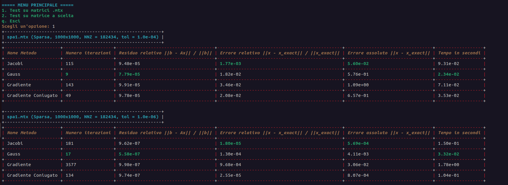
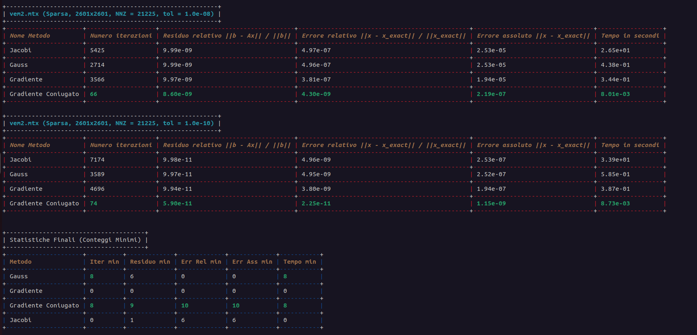
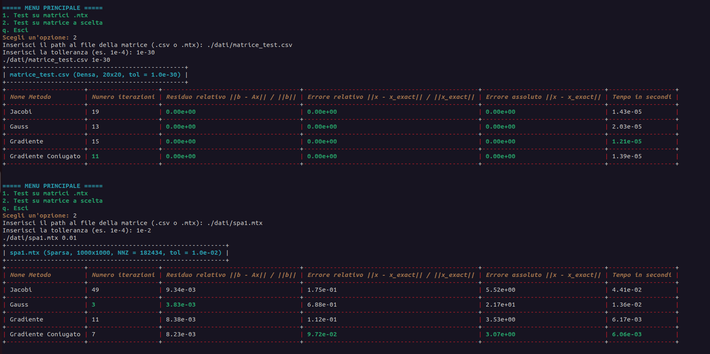
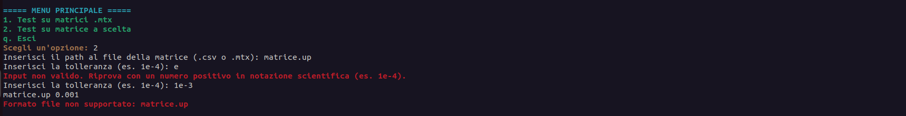
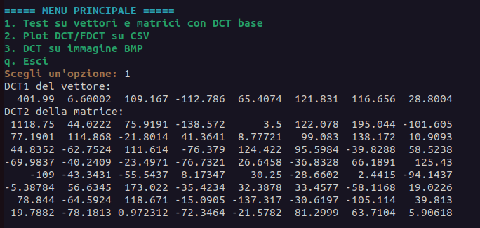
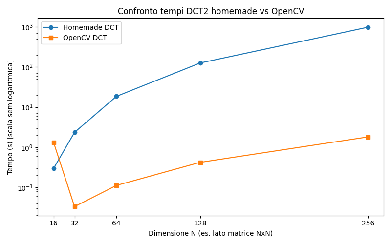
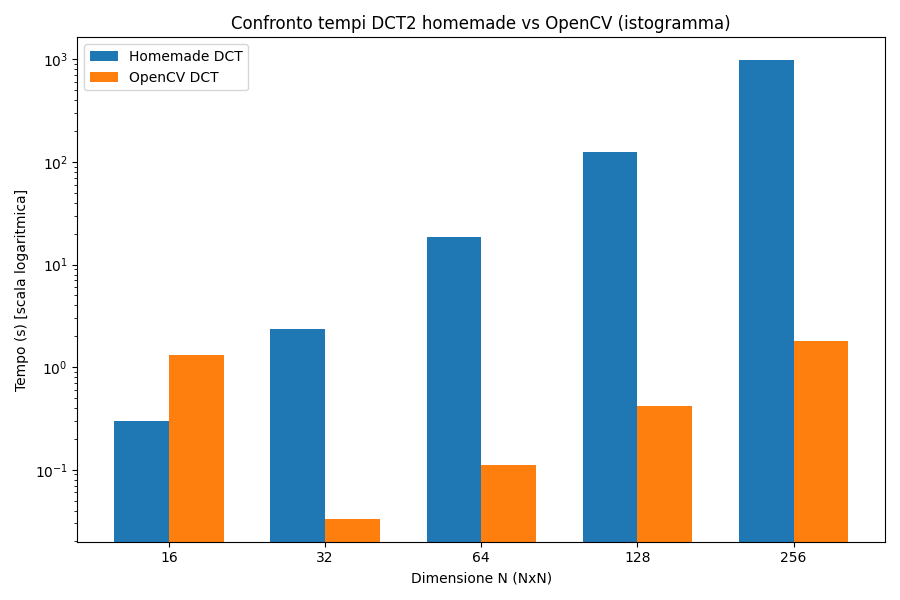
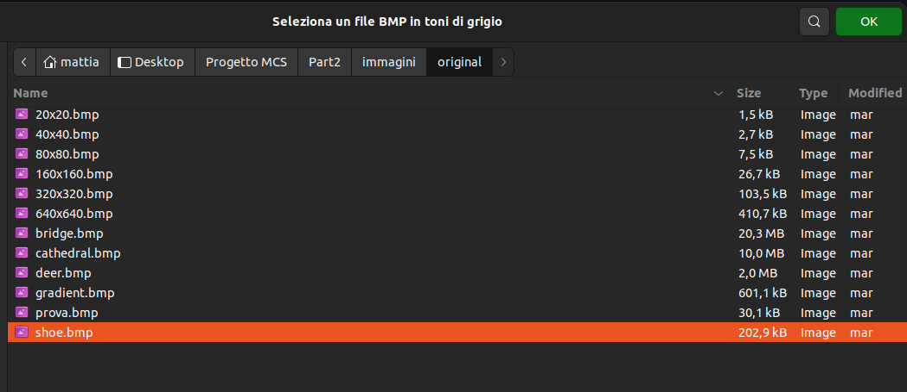
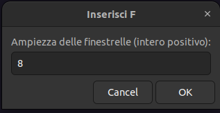
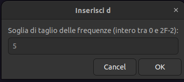

# Progetto 1: Mini libreria per sistemi lineari (Parte I)

## 1. Introduzione

Nella **Parte I** del progetto è stata creata una libreria per la risoluzione di sistemi lineari mediante metodi iterativi. L’obiettivo è implementare e validare i **quattro** solutori iterativi per matrici simmetriche e definite positive:

1. Metodo di Jacobi
2. Metodo di Gauss–Seidel
3. Metodo del Gradiente
4. Metodo del Gradiente Coniugato

---

## 2. Nozioni teoriche

### 2.1 Matrici simmetriche e definite positive

Le metodologie iterative qui descritte richiedono matrici $A \in \mathbb{R}^{n\times n}$ tali che:

* **Simmetria**: $A = A^T$
* **Definità positiva**: $x^T A x > 0$ per ogni $x \neq 0$

#### Perché le matrici SPD garantiscono la convergenza?

Le matrici **simmetriche e definite positive (SPD)** possiedono proprietà fondamentali che garantiscono la convergenza dei metodi iterativi:

1. **Autovalori reali e positivi**: Essendo $A$ simmetrica, tutti gli autovalori $\lambda_i$ sono reali. La definità positiva garantisce inoltre che $\lambda_i > 0$ per ogni $i$.

2. **Condizione necessaria per la convergenza**: Per i metodi di splitting come Jacobi e Gauss-Seidel, la convergenza è garantita quando il **raggio spettrale** della matrice di iterazione è $\rho < 1$. Per matrici SPD:
   - **Jacobi**: $\rho(D^{-1}(L+U)) < 1$ è garantito
   - **Gauss-Seidel**: $\rho((D+L)^{-1}U) < 1$ è sempre verificato

3. **Proprietà energetica**: La definità positiva implica che la funzione quadratica $f(x) = \frac{1}{2}x^T A x - b^T x$ ha un **unico minimo globale**, rendendo ben posti i metodi del gradiente.

4. **Numero di condizionamento finito**: Per matrici SPD, $\kappa(A) = \frac{\lambda_{\max}}{\lambda_{\min}} < \infty$, garantendo stabilità numerica.

---

### 2.2 Metodo di Jacobi

**Descrizione**: Il metodo di Jacobi separa la matrice $A$ in una parte diagonale $D$ e nel resto $R = A - D$. A partire da un’approssimazione iniziale $x^{(0)}$, la regola iterativa è:

$$
x^{(k+1)} = D^{-1} \bigl(b - R\,x^{(k)}\bigr)
$$

La convergenza è garantita se $A$ è simmetrica e definita positiva.

### 2.3 Metodo di Gauss–Seidel

**Descrizione**: Il metodo di Gauss–Seidel sfrutta i valori aggiornati di $x^{(k+1)}$ durante la stessa iterazione. Si esprime $A = D + L + U$ (triangolare inferiore $L$, superiore $U$) e si applica:

$$
x^{(k+1)} = (D + L)^{-1} \bigl(b - U\,x^{(k)}\bigr)
$$

Rispetto a Jacobi, converge generalmente più velocemente per matrici SPD.

### 2.4 Metodo del Gradiente

**Descrizione**: Basato sulla minimizzazione della funzione quadratica $f(x) = \frac{1}{2} x^T A x - b^T x$. Definito il residuo $r^{(k)} = b - A x^{(k)}$, l’iterazione segue:

$$
x^{(k+1)} = x^{(k)} + \alpha^{(k)} r^{(k)},
$$

dove

$$
\alpha^{(k)} = \frac{r^{(k)T} r^{(k)}}{r^{(k)T} A r^{(k)}}.
$$

### 2.5 Metodo del Gradiente Coniugato

**Descrizione**: Costruisce direzioni $p^{(k)}$ coniugate rispetto a $A$. Algoritmo:

1. $x^{(0)}$ iniziale, $r^{(0)} = b - A x^{(0)}$, $p^{(0)} = r^{(0)}$.
2. Per $k=0,1,\dots$ finché non converge:

   * $\alpha^{(k)} = \frac{r^{(k)T} r^{(k)}}{p^{(k)T} A p^{(k)}}$
   * $x^{(k+1)} = x^{(k)} + \alpha^{(k)} p^{(k)}$
   * $r^{(k+1)} = r^{(k)} - \alpha^{(k)} A p^{(k)}$
   * $\beta^{(k)} = \frac{r^{(k+1)T} r^{(k+1)}}{r^{(k)T} r^{(k)}}$
   * $p^{(k+1)} = r^{(k+1)} + \beta^{(k)} p^{(k)}$

Questo metodo converge in al massimo $n$ iterazioni per una matrice $n\times n$ SPD.

---

### 2.6 Confronto teorico della velocità di convergenza

La velocità di convergenza dei metodi iterativi dipende dalle proprietà spettrali della matrice $A$ e può essere analizzata teoricamente:

#### **Jacobi vs Gauss-Seidel**
- **Gauss-Seidel converge sempre più velocemente** di Jacobi per matrici SPD
- **Fattore di miglioramento**: Teoricamente, Gauss-Seidel può convergere fino a **2 volte più velocemente** di Jacobi
- **Ragione**: Gauss-Seidel utilizza i valori aggiornati $x_i^{(k+1)}$ nella stessa iterazione, accelerando la propagazione dell'informazione

#### **Metodi del Gradiente**
- **Gradiente semplice**: Convergenza lineare con fattore $\left(\frac{\kappa(A)-1}{\kappa(A)+1}\right)^2$
- **Gradiente Coniugato**: Convergenza **superlineare**, teoricamente in al massimo $n$ iterazioni
- **Vantaggio del CG**: Per matrici ben condizionate, converge in molto meno di $n$ iterazioni praticamente

#### **Dipendenza dal numero di condizionamento**
Per una matrice con numero di condizionamento $\kappa(A)$:

| Metodo | Iterazioni per $\epsilon$ precisione | Dipendenza da $\kappa$ |
|--------|--------------------------------------|------------------------|
| **Jacobi** | $O(\kappa \log(1/\epsilon))$ | Lineare |
| **Gauss-Seidel** | $O(\sqrt{\kappa} \log(1/\epsilon))$ | Radice quadrata |
| **Gradiente** | $O(\kappa \log(1/\epsilon))$ | Lineare |
| **Gradiente Coniugato** | $O(\sqrt{\kappa} \log(1/\epsilon))$ | Radice quadrata |

**Implicazione pratica**: Per matrici mal condizionate ($\kappa >> 1$), **Gauss-Seidel e Gradiente Coniugato** sono significativamente superiori.

## 3. Struttura del progetto/codice (Parte 1)

La cartella principale di questa parte del progetto è `Part1`, organizzata come segue:

```
Part1/
├── dati/                   # Contiene matrici di test in formato Matrix Market (.mtx) e CSV (.csv)
├── linear_resolver.hpp     # Implementazione dei metodi iterativi per la risoluzione di sistemi lineari:
│                           # Jacobi, Gauss–Seidel, Gradiente, Gradiente Coniugato
├── lr_utils.hpp            # Funzioni di supporto e utility per la classe linear_resolver
├── lr_test.hpp             # Classe per l’esecuzione di test e la generazione di tabelle a terminale
│                           # con le colonne: Metodo | #iterazioni | Residuo rel | Err rel | Err ass | Tempo (s)
├── main.cpp                # Interfaccia utente a terminale con menu interattivo per selezionare test e matrici
├── Makefile                # Script per compilare (make build) ed eseguire (make run) il programma main.cpp
├── tabulate.hpp            # Libreria header-only per la formattazione di tabelle ASCII a terminale
│
└── ../Eigen/               # Libreria Eigen inclusa come dipendenza locale, usata per strutture dati dense e sparse
```

---

### Note sulla struttura e flusso del progetto

* La cartella **`dati/`** contiene matrici di test, sia sparse (`.mtx`) sia dense (`.csv`), utilizzate per validare e confrontare le prestazioni dei metodi iterativi.

* La classe **`linear_resolver.hpp`** implementa i quattro principali metodi iterativi per la risoluzione di sistemi lineari, sfruttando la libreria Eigen per la gestione delle matrici.

* La classe **`lr_test.hpp`** gestisce l’esecuzione automatica o manuale dei test, producendo a terminale tabelle dettagliate che mostrano, per ogni metodo:

  * Numero di iterazioni effettuate,
  * Residuo relativo,
  * Errore relativo rispetto alla soluzione esatta,
  * Errore assoluto,
  * Tempo di esecuzione in secondi.

* Il file **`main.cpp`** offre un’interfaccia a menu semplice e intuitiva per selezionare matrici e modalità di test.

* Il **Makefile** consente di automatizzare la compilazione e l’esecuzione, semplificando l’uso del progetto anche per utenti meno esperti.

* La libreria **`tabulate.hpp`** permette di ottenere un output a terminale ben leggibile e ordinato, migliorando notevolmente l’esperienza di analisi dei risultati.

* L’inclusione di **Eigen come dipendenza locale** garantisce la portabilità del progetto senza richiedere installazioni esterne.

---

Questa organizzazione garantisce una chiara separazione tra:

* **Codice core C++** (metodi risolutivi, test, utility),
* **Dati di input** (matrici sparse e dense),
* **Interfaccia utente** (menu e output tabellari),
* **Dipendenze esterne** (Eigen e librerie header-only).

---

## 4. Classi e componenti principali

### 4.1 Classe `linear_resolver<MatrixType>`

Questa è la classe principale che implementa i **metodi iterativi per la risoluzione di sistemi lineari** della forma `Ax = b`. È una **classe template** compatibile sia con matrici dense (`Eigen::MatrixXd`) che sparse (`Eigen::SparseMatrix<double>`), grazie alla flessibilità offerta da Eigen.

---

#### Costruttore

```cpp
linear_resolver(const MatrixType& A, const double& tol);
```

* Inizializza il sistema salvando la matrice `A` e una **tolleranza** `tol`.
* Costruisce internamente un **vettore soluzione noto** `x` di tutti `1`, e calcola `b = A * x`.
  Questo permette di conoscere in anticipo la soluzione esatta per valutare l’errore dei metodi iterativi.

---

#### Metodi Iterativi

Tutti i metodi ritornano una tupla contenente:

```cpp
(x, numero_iterazioni, residuo_relativo, tempo_sec, errore_assoluto, errore_relativo)
```

##### Jacobi

```cpp
auto result = jacobi_resolver(A, b);
```

Implementa il metodo di **Jacobi classico**, basato sull'uso della diagonale `D` di `A`:

```cpp
x = x + D⁻¹ * (b - A * x);
```

Internamente utilizza:

```cpp
Eigen::MatrixXd D_inv = D.cwiseInverse().asDiagonal();
```

##### Gauss-Seidel

```cpp
auto result = gauss_resolver(A, b);
```

Implementa il metodo di **Gauss-Seidel**, basato su **forward substitution**:

```cpp
r = b - A * x;
y = forward_substitution(P, r);
x = x + y;
```

dove `P` è la matrice triangolare inferiore estratta da `A`.

##### Metodo del Gradiente

```cpp
auto result = gradient_resolver(A, b);
```

Metodo del **gradiente semplice** (steepest descent), con calcolo del passo `α`:

```cpp
alpha = (rᵗr) / (rᵗ A r);
x = x + alpha * r;
```

##### Gradiente Coniugato

```cpp
auto result = conjugate_gradient_resolver(A, b);
```

Implementa il classico **gradiente coniugato**, con direzione coniugata `d`:

```cpp
alpha = (rᵗd) / (dᵗ A d);
x = x + alpha * d;
r = b - A * x;
d = r - beta * d;
```

---

#### Metodi di Accesso

* `getA()` — Ritorna la matrice `A` originale.
* `getb()` — Ritorna il vettore dei termini noti `b`.

---

#### Dettagli Implementativi

* Ogni metodo misura il **tempo di esecuzione** tramite `std::chrono`.
* Il **numero massimo di iterazioni** è impostato a `20000`.
* Il residuo relativo è valutato tramite `r.norm() / b.norm()` ad ogni iterazione.
* L’**errore assoluto** e **relativo** rispetto alla soluzione esatta `x = 1` sono inclusi nei risultati.
* La classe è **modulare e generica**, adatta a test comparativi e benchmarking su diversi formati di matrice.

---

### 4.2 Namespace `lr_utils`

Questo namespace raccoglie una serie di funzioni di utilità per supportare l’implementazione dei metodi iterativi nella classe `linear_resolver`. Le principali funzionalità includono:

* **Estrazione della diagonale**:
  Funzioni `getD` sovraccaricate per estrarre il vettore diagonale principale da matrici dense (`Eigen::MatrixXd`) o sparse (`Eigen::SparseMatrix<double>`).

* **Sostituzione in avanti (Forward substitution)**:
  Implementazioni personalizzate di forward substitution per risolvere sistemi triangolari inferiori $P y = r$, adattate sia per matrici dense sia sparse.
  Questo perché le funzioni predefinite di Eigen di forward substituition non sono ottimizzate per il nostro use case.

* **Estrazione della matrice triangolare inferiore**:
  Funzioni `getLowerTriangular` per ottenere la matrice triangolare inferiore (inclusa la diagonale) da una matrice densa o sparsa.
  Questa matrice $P = D + L$ viene usata nel metodo di Gauss–Seidel.

**Dettagli implementativi importanti**:

* La forward substitution per matrici sparse viene eseguita convertendo temporaneamente la matrice in formato `RowMajor` per iterare efficientemente riga per riga.
* Per la matrice triangolare inferiore sparsa, viene creata tramite un vettore di triplette (coordinate non nulle) per mantenere la struttura sparsa e ottimizzare le operazioni successive.

---

### 4.3 Classe `lr_test`

Classe template `lr_test<MatrixType>` che si occupa di testare i metodi iterativi implementati in `linear_resolver` su matrici caricate da file. Supporta sia matrici dense (`Eigen::MatrixXd`) che sparse (`Eigen::SparseMatrix<double>`).

* **Caricamento matrici automatico da cartella**:
  La classe esegue una scansione automatica della cartella `./dati` per individuare tutti i file con estensione `.mtx`.
  Questo significa che non ci sono matrici "hardcoded" nel codice:

  * Per aggiungere nuovi test è sufficiente inserire nuovi file `.mtx` nella cartella `dati`
  * Per rimuovere test basta cancellare o spostare i file `.mtx`.
    Non è necessario modificare il codice per cambiare i dataset testati, garantendo flessibilità e facilità di estensione.


* **Test multipli su tolleranze**:
  Per ogni matrice e per un insieme di tolleranze predefinite (`1e-4`, `1e-6`, `1e-8`, `1e-10`), applica tutti e quattro i metodi iterativi.

* **Creazione tabelle di risultati**:
  Per ogni esecuzione genera tabelle formattate con la libreria `tabulate` contenenti:

  * Nome metodo
  * Numero di iterazioni
  * Residuo relativo $\|b - Ax\| / \|b\|$
  * Errore relativo $\|x - x_{\text{exact}}\| / \|x_{\text{exact}}\|$
  * Errore assoluto $\|x - x_{\text{exact}}\|$
  * Tempo di esecuzione (secondi)

* **Colorazione automatica**:
  Evidenzia in verde i valori migliori (minimi) in ciascuna colonna (es. minimo numero di iterazioni, minimo residuo, ecc).

* **Statistiche aggregate**:
  Dopo aver eseguito tutti i test, crea una tabella di statistiche che conta quante volte ciascun metodo ha ottenuto il valore minimo per ogni metrica.

**Dettagli implementativi importanti**:

* Usa C++17, `std::filesystem` per navigare i file.
* Usa la libreria `Eigen` per manipolare matrici sparse e dense.
* Implementa metodi per estrarre i dati dai risultati e formattarli per la visualizzazione.
* La gestione del colore e dello stile è gestita tramite `tabulate`.

---

### 4.4 Classe `main.cpp`

Il file `main.cpp` fornisce un’interfaccia a terminale interattiva per eseguire i test della mini-libreria su sistemi lineari.

#### **Funzionalità principali**

* **Menu interattivo** con tre opzioni:

  1. Esecuzione automatica dei test su tutte le matrici `.mtx` nella directory `./dati`.
  2. Esecuzione di un test su una singola matrice specificata manualmente (in formato `.mtx` o `.csv`).
  3. Uscita dal programma.

* **Caricamento dinamico delle matrici**:

  * Le matrici sparse (`.mtx`) vengono caricate usando `Eigen::loadMarket`.
  * Le matrici dense (`.csv`) vengono parse manualmente (è possibile specificare il separatore).
  * Le matrici `.mtx` nella cartella `./dati` vengono caricate **automaticamente**, senza necessità di modifiche al codice.

* **Richiesta della tolleranza**:

  * L’utente può fornire una tolleranza personalizzata, validata per garantire che sia un numero positivo.

#### **Visualizzazione dei risultati**

Dopo ogni test, i risultati vengono stampati a terminale sotto forma di **tabelle ben formattate** (grazie alla libreria `tabulate.hpp`), che riportano per ciascun metodo:

* Numero di iterazioni
* Residuo relativo: `||b - Ax|| / ||b||`
* Errore relativo: `||x - x_exact|| / ||x_exact||`
* Errore assoluto: `||x - x_exact||`
* Tempo di esecuzione in secondi

Inoltre:

* I valori migliori in ogni colonna vengono **evidenziati in verde**, per facilitare il confronto.
* Alla fine dei test automatici (opzione 1) viene mostrata una **tabella riassuntiva**, che conta quante volte ciascun metodo ha ottenuto il valore minimo su ciascuna metrica.

Questa tabella riassuntiva è estremamente utile per confrontare le prestazioni dei metodi in modo aggregato e visivo, fornendo indicazioni sintetiche ma molto efficaci sull’efficienza e sull’accuratezza relativa dei solutori.

* **Colori ANSI nel terminale**:

  * Messaggi colorati per migliorare la leggibilità e l’usabilità (ad esempio, errori in rosso, prompt in giallo, menu in ciano/verde).

#### **Flusso di utilizzo**

All’avvio il programma mostra il menu e attende l’input dell’utente. A seconda della scelta, viene eseguita la funzione corrispondente. La modalità rimane interattiva finché l’utente non sceglie di uscire con l’opzione `q`.

---

#### **Esempi di output terminale**

##### Opzione 1 - 

(...Ci sono in totale 16 tabelle dato che abbiamo 4 matrici e 4 tolleranze per ognuna...)


##### Opzione 2 -




---

## 5. Interpretazione dei Risultati - Modalità Automatica/Opzione 1 (.mtx)

Quando si seleziona l'opzione `1` dal menu a terminale, il programma esegue un **test automatico su tutte le matrici sparse `.mtx`** presenti nella cartella `./dati`. Per ciascuna matrice vengono applicati i metodi iterativi implementati (Jacobi, Gauss-Seidel, Gradiente, Gradiente Coniugato), e i risultati vengono presentati in **tabelle dettagliate**. Alla fine viene inoltre generata una **tabella riepilogativa** che mostra **quante volte ogni metodo ha ottenuto il risultato migliore** per ciascuna metrica:

```
+--------------------------------------+
| Statistiche Finali (Conteggi Minimi) |
+--------------------------------------+
| Metodo              | Iter min | Residuo min | Err Rel min | Err Ass min | Tempo min |
|---------------------|----------|-------------|-------------|-------------|-----------|
| Gauss               | 8        | 6           | 0           | 0           | 8         |
| Gradiente           | 0        | 0           | 0           | 0           | 0         |
| Gradiente Coniugato | 8        | 9           | 10          | 10          | 8         |
| Jacobi              | 0        | 1           | 6           | 6           | 0         |
```

### Considerazioni sui risultati ottenuti

* Il **Gradiente Coniugato** emerge chiaramente come **il metodo più performante in assoluto**, avendo ottenuto i risultati migliori in quasi tutte le metriche: rapidità di convergenza, accuratezza e tempo computazionale.
* Il **Gauss-Seidel** si dimostra una buona alternativa, con prestazioni competitive soprattutto in termini di numero di iterazioni e tempo.
* Il **Jacobi** è meno efficace ma occasionalmente riesce a ottenere residui minimi.
* Il **Gradiente semplice** non ha mai ottenuto prestazioni ottimali, indicando una **efficacia limitata** nel contesto delle matrici testate.

Questa tendenza è giustificata teoricamente e confermata empiricamente: tutte le matrici `.mtx` utilizzate (`spa1.mtx`, `spa2.mtx`, `vem1.mtx`, `vem2.mtx`) sono **grandi, sparse, simmetriche e definite positive (SPD)** — condizioni ideali per l’applicazione del metodo del **Gradiente Coniugato (CG)**.

### Perché il Gradiente Coniugato domina su matrici sparse?

L'eccellente performance del **CG** è dovuta a una combinazione di fattori **teorici, strutturali e computazionali**:

#### 1. Ottimalità teorica per matrici SPD

* Il CG è **teoricamente ottimale**, in quanto minimizza l'errore nella norma $A$-energetica all'interno dello spazio di Krylov generato.
* Con **autovalori ben raggruppati**, la **convergenza è molto rapida**, spesso ben oltre i bound teorici pessimisti.

#### 2. Sfruttamento della struttura sparsa

Le matrici testate hanno una struttura altamente sparsificata:

| Matrice    | Dimensione | NNZ       | Sparsità (%) |
| ---------- | ---------- | --------- | ------------ | 
| `spa1.mtx` | 1000×1000  | 182,434   | 18.2%        | 
| `spa2.mtx` | 3000×3000  | 1,633,298 | 18.1%        | 
| `vem1.mtx` | 1681×1681  | 13,385    | 0.47%        | 
| `vem2.mtx` | 2601×2601  | 21,225    | 0.31%        | 

In particolare, `vem1` e `vem2` sono **molto più sparse** (meno dell'1% di elementi non nulli), e il CG riesce a **sfruttare al meglio la  struttura sparsa della matrice**, riducendo drasticamente il numero di operazioni necessarie a ogni iterazione.

#### 3. Vantaggi computazionali specifici del CG

* Ogni iterazione richiede **solo un prodotto matrice-vettore**, con costo $O(NNZ)$ invece di $O(n^2)$.
* **Uso efficiente della memoria**: sono necessari solo pochi vettori ausiliari.
* **Ottima località di memoria**: le strutture dati sparse sono contigue e cache-friendly.
* Le direzioni coniugate **adattano dinamicamente** la ricerca, "imparando" la geometria del problema.

#### 4. Limiti degli altri metodi

* **Jacobi** e **Gauss-Seidel** richiedono risoluzioni locali (diagonale o triangolare) che diventano costose con matrici molto grandi e sparse.
* Il **Gradiente semplice** non genera direzioni coniugate, risultando **lento su matrici mal condizionate**.

---

# Progetto 2: Compressione di immagini tramite DCT (Parte II)

## 1. Introduzione

Questa seconda parte del progetto riguarda la compressione di immagini tramite la Trasformata Discreta del Coseno bidimensionale (DCT2). Sono state implementate sia una versione "homemade" che una versione basata su libreria (OpenCV), con l'obiettivo di confrontare le prestazioni e sviluppare un software per processare immagini BMP, applicare la DCT2 a blocchi, effettuare il taglio delle frequenze e ricostruire l'immagine compressa.

---

## 2. Nozioni teoriche:

### 2.1 DCT2

La **Trasformata Discreta del Coseno bidimensionale (DCT2)** consente di rappresentare una matrice (tipicamente un'immagine) come combinazione lineare di funzioni coseno a diverse frequenze spaziali. È ampiamente utilizzata nella compressione JPEG per la sua capacità di concentrare l'energia dell'immagine nei coefficienti a bassa frequenza, rendendo possibile una compressione efficace con minima perdita percettiva.

La formula generale della DCT2, applicata a una matrice quadrata $A$ di dimensione $N \times N$, è:

$$
C_{u,v} = \alpha(u)\alpha(v) \sum_{x=0}^{N-1} \sum_{y=0}^{N-1} A_{x,y} \cos\left[\frac{\pi}{N}\left(x+\frac{1}{2}\right)u\right] \cos\left[\frac{\pi}{N}\left(y+\frac{1}{2}\right)v\right]
$$

dove:

* $\alpha(0) = \sqrt{1/N}$
* $\alpha(k) = \sqrt{2/N}$ per $k > 0$

Questa trasformata è separabile: si può implementare come due trasformate DCT1D successive, prima per righe e poi per colonne.

#### **Concentrazione dell'energia: concetto fondamentale**

Il potere della DCT2 nella compressione deriva dalla sua capacità di **concentrare l'energia** del segnale:

1. **Energia del segnale**: L'energia totale di un'immagine è $E = \sum_{i,j} I_{i,j}^2$ (norma di Frobenius al quadrato)

2. **Proprietà di conservazione**: La DCT è una trasformata **unitaria**, quindi conserva l'energia:
   $$\sum_{i,j} I_{i,j}^2 = \sum_{u,v} C_{u,v}^2$$
   dove $C_{u,v}$ sono i coefficienti DCT.

3. **Concentrazione nei coefficienti bassi**: Per immagini naturali, **la maggior parte dell'energia si concentra nei coefficienti $(u,v)$ con $u,v$ piccoli** (basse frequenze).

#### **Perché avviene questa concentrazione?**

**Immagini naturali hanno caratteristiche specifiche**:
- **Correlazione spaziale**: Pixel vicini tendono ad avere valori simili
- **Variazioni graduali**: Poche discontinuità brusche (alte frequenze)
- **Strutture regolari**: Oggetti, bordi, texture hanno componenti frequenziali dominanti

**La DCT sfrutta queste proprietà**:
- Le **funzioni coseno a bassa frequenza** catturano le variazioni lente (background, illuminazione generale)
- Le **funzioni ad alta frequenza** catturano i dettagli fini (bordi, texture, rumore)

#### **Esempio quantitativo**

Per un blocco 8×8 tipico:
```
Coefficienti con energia significativa:
- DC (0,0): ~40-60% dell'energia totale
- Primi 10 coefficienti: ~80-90% dell'energia
- Ultimi 20 coefficienti: ~1-5% dell'energia
```

**Implicazione per la compressione**: Eliminando i coefficienti ad alta frequenza (soglia $d$), si perde solo una piccola frazione dell'energia, ma si ottiene una significativa **riduzione dei dati**.

---

### IDCT2

Per ricostruire l'immagine dai coefficienti DCT, si applica la **trasformata inversa (IDCT2)**:

$$
A_{x,y} = \sum_{u=0}^{N-1} \sum_{v=0}^{N-1} \alpha(u)\alpha(v) C_{u,v} \cos\left[\frac{\pi}{N}\left(x+\frac{1}{2}\right)u\right] \cos\left[\frac{\pi}{N}\left(y+\frac{1}{2}\right)v\right]
$$

dove:
* $C_{u,v}$ sono i coefficienti DCT
* $\alpha(0) = \sqrt{1/N}$, $\alpha(k) = \sqrt{2/N}$ per $k > 0$
* $(x,y)$ sono le coordinate spaziali nell'immagine ricostruita

#### **Relazione DCT-IDCT**

La coppia **DCT/IDCT** forma una trasformazione **ortogonale perfetta**:
- **DCT**: $\mathcal{F}: \mathbb{R}^{N \times N} \rightarrow \mathbb{R}^{N \times N}$ (dominio spaziale → dominio frequenziale)
- **IDCT**: $\mathcal{F}^{-1}: \mathbb{R}^{N \times N} \rightarrow \mathbb{R}^{N \times N}$ (dominio frequenziale → dominio spaziale)
- **Proprietà di inversione**: $\mathcal{F}^{-1}(\mathcal{F}(A)) = A$ (ricostruzione perfetta)

#### **Processo di compressione con soglia**

1. **DCT**: $C = \mathcal{F}(A)$ (blocco originale → coefficienti)
2. **Quantizzazione/Soglia**: $\tilde{C}_{u,v} = \begin{cases} C_{u,v} & \text{if } u+v < d \\ 0 & \text{if } u+v \geq d \end{cases}$
3. **IDCT**: $\tilde{A} = \mathcal{F}^{-1}(\tilde{C})$ (coefficienti compressi → blocco ricostruito)

**Errore di ricostruzione**: $E = \|A - \tilde{A}\|_F^2 = \sum_{u+v \geq d} C_{u,v}^2$

Questo errore corrisponde esattamente all'**energia dei coefficienti scartati**, dimostrando l'efficacia del criterio di soglia basato sulla frequenza.

---

## 3. Struttura del progetto/codice (Parte 2)

La seguente struttura rappresenta l'organizzazione dei file e delle directory relativi alla seconda parte del progetto, dedicata alla **compressione di immagini in scala di grigi tramite DCT2** e al confronto con funzioni OpenCV:

```
Part2/
├── main.cpp               # Interfaccia utente a terminale con menu per eseguire i test disponibili
├── DCT.hpp                # Implementazione "homemade" della DCT1D e DCT2D con Eigen
├── DCT_basic_test.hpp     # Classe di test per verificare la correttezza della DCT homemade su vettori e matrici
├── DCT_FDCT.hpp           # Classe per confronto prestazionale tra DCT homemade e OpenCV
├── BMP_FDCT.hpp           # Gestione caricamento immagini BMP e compressione JPEG-like tramite DCT+IDCT
├── json.hpp               # Libreria header-only per la gestione del formato JSON in C++
│
├── dct-fdct-plots/        
│   ├── dct_fdct_plot.py   # Script Python per generare plot (lineplot, histogram) dai risultati JSON
│   └── results.json       # File JSON generato da DCT_FDCT.hpp coi tempi delle matrici
│
├── immagini/
│   ├── original/          # Immagini BMP in scala di grigio per test e compressione
│   └── after_dct/         # Immagini compresse salvate dopo elaborazione DCT+IDCT (generate da BMP_FDCT)
│
├── external/
│   └── tinyfiledialogs/   # Sorgenti e header della libreria tinyfiledialogs (usata da BMP_FDCT)
│
├── matrix/
│    ├── matrix_gen.py      # Script Python per generare matrici di test quadrate NxN con valori casuali
│    └── *.csv              # Matrici di test generate (es. 16x16, 32x32, ...) per confronto DCT
│  
└── ../Eigen/               # Libreria Eigen inclusa come dipendenza locale, usata per strutture dati dense e sparse
```

---

### Note sulla struttura e flusso del progetto

* La **cartella `matrix/`** contiene matrici di test in formato CSV, generate automaticamente tramite lo script `matrix_gen.py`. Queste matrici sono usate per valutare e confrontare le prestazioni tra la DCT homemade e la funzione `cv::dct` di OpenCV.

* Il modulo **`DCT_FDCT.hpp`** esegue i test su tutte le matrici CSV della cartella `matrix/`, misura i tempi delle due implementazioni e salva i dati nel file JSON `dct-fdct-plots/results.json`.

* Lo **script Python `dct_fdct_plot.py`** elabora questo JSON per creare grafici comparativi, facilitando l’analisi visiva delle prestazioni.

* La classe **`BMP_FDCT.hpp`** permette di selezionare interattivamente immagini BMP in scala di grigio, applica la compressione DCT basata su blocchi con soglia `d`, visualizza il risultato affiancato all’originale (in finestra non ridimensionabile) e salva l’immagine compressa nella cartella `immagini/after_dct/`.

* La **libreria `tinyfiledialogs`** è integrata per gestire le finestre di dialogo cross-platform, utilizzate nell’interfaccia grafica minimale per la selezione di file e parametri.

* Il file **`main.cpp`** coordina l’interazione a terminale, offrendo un menu chiaro per scegliere tra test di verifica, test prestazionali con grafici e compressione di immagini.

* Il **Makefile** consente di automatizzare la compilazione, la presenza delle dipendenze e l’esecuzione, semplificando l’uso del progetto anche per utenti meno esperti.

* L’inclusione di **Eigen come dipendenza locale** garantisce la portabilità del progetto senza richiedere installazioni esterne.
---

Questa organizzazione garantisce una chiara separazione tra:

* **Codice core C++** per implementazioni, test e compressione,
* **Dati di input/output** (immagini, matrici, risultati JSON),
* **Script esterni per analisi** (grafici Python),
* **Dipendenze esterne** (librerie header-only e file di dialogo).

---

## 4. Requisiti e Dipendenze

Per il corretto funzionamento del progetto (Parte 2), sono richiesti i seguenti strumenti e librerie:

### Dipendenze principali

* **Python 3**
  Necessario per eseguire gli script nella cartella `dct-fdct-plots/` e per generare le matrici test (`matrix/matrix_gen.py`).

* **matplotlib (Python)**
  Utilizzato per creare grafici comparativi a partire dai risultati salvati in formato JSON.
  Installazione consigliata:

  ```bash
  pip install matplotlib
  ```

* **OpenCV (C++)**
  Utilizzato per:

  * Applicare la DCT2 e IDCT2 "fast" (`cv::dct`, `cv::idct`) in alternativa alla versione "homemade".
  * Visualizzare le immagini in output, affiancando l’**immagine originale** e quella **compressa** in una finestra interattiva.

  Installazione (su sistemi Debian/Ubuntu):

  ```bash
  sudo apt install libopencv-dev
  ```

* **zenity**
  Necessaria per il corretto funzionamento delle finestre di dialogo di `tinyfiledialogs`, usate per la selezione interattiva dei file BMP.
  Installazione (Debian/Ubuntu):

  ```bash
  sudo apt install zenity
  ```

---

## 5. Classi e componenti principali

### 5.1 Classe `DCT`

La classe `DCT` implementa la **Trasformata Discreta del Coseno (DCT)** in versione 1D e 2D utilizzando la libreria Eigen per la manipolazione delle matrici e vettori.

* **Metodo `run_DCT`**: calcola la DCT1D di un vettore `Eigen::VectorXd`, secondo la formula standard con coefficienti di normalizzazione $\alpha(k)$:

$$
a_k = \alpha(k) \sum_{i=0}^{n-1} v_i \cos\left[\frac{\pi}{n} k \left(i + \frac{1}{2}\right)\right]
$$

* **Metodo `run_DCT2`**: calcola la DCT2D di una matrice quadrata `Eigen::MatrixXd` di dimensione $n \times n$ applicando la DCT1D prima su ogni riga e poi su ogni colonna.

* **Temporizzazione**: il metodo `run_DCT2` misura il tempo di esecuzione in millisecondi e lo memorizza nell’attributo pubblico `time`.

> **Nota sulla complessità computazionale:**
> Questa implementazione della DCT2 ha complessità computazionale di ordine $O(n^3)$ rispetto alla dimensione della matrice, poiché per ogni elemento della matrice vengono effettuati calcoli che richiedono un numero di operazioni proporzionale a $n$.
> Si tratta quindi di un’implementazione **non ottimizzata**, rispetto a versioni più efficienti basate su algoritmi FFT-like che raggiungono complessità $O(n^2 \log n)$.

---

### 5.2 Classe `DCTBasicTest`

Questa classe funge da **verifica funzionale** per la classe `DCT`, utilizzando un vettore e una matrice 8×8 con valori noti, presi direttamente dal documento di progetto.

I risultati prodotti da `test_vector()` e `test_matrix()` possono essere confrontati con quelli attesi forniti nel documento di progetto per validare la correttezza dell’implementazione della DCT1D e DCT2D.

**Metodi principali:**

* `test_vector(const Eigen::VectorXd&)`: calcola e stampa la DCT1D di un vettore di input.
* `test_matrix(const Eigen::MatrixXd&)`: calcola e stampa la DCT2D di una matrice di input.

Questa classe facilita il debug e la validazione preliminare della trasformata prima di applicarla su dati più complessi come immagini.

---

### 5.3 Classe `DCTFDCT`

Questa classe si occupa di eseguire un **confronto tra la DCT2 "homemade" implementata nella classe `DCT` e la DCT2 fornita da OpenCV** (`cv::dct`) su matrici di test caricate da file CSV.

**Funzionalità principali:**

* Scansiona la cartella `./matrix` alla ricerca di file `.csv` contenenti matrici quadrate.

* Per ogni matrice:

  1. Calcola la DCT2 con la versione homemade (`DCT::run_DCT2`), misurandone il tempo.
  2. Calcola la DCT2 con la funzione `cv::dct` di OpenCV, misurandone il tempo.
  3. Memorizza i tempi di esecuzione e le dimensioni della matrice in un file JSON (`./dct-fdct-plots/results.json`).

* Avvia uno script Python (`dct_fdct_plot.py`) per generare grafici comparativi dai dati JSON.

**Dettagli implementativi:**

* La conversione da `Eigen::MatrixXd` a `cv::Mat` è gestita internamente.
* Il confronto tiene conto solo del tempo di calcolo, non dell’accuratezza.
* L’ordinamento dei file CSV avviene in base alla dimensione del file, per partire da matrici più piccole, così che i grafici siano visivamente più facili da comprendere.

**Generazione automatica delle matrici di test**

Nella cartella `./matrix` è presente lo script Python `matrix_gen.py` che permette di generare automaticamente matrici quadrate di diverse dimensioni da utilizzare come input per i test. Lo script crea matrici di dimensioni variabili (ad esempio, 16x16, 32x32, 64x64, 128x128, 256x256) popolate con valori interi casuali nell’intervallo \[0, 255]. Ogni matrice viene salvata in un file `.csv` nominato con la dimensione corrispondente, ad esempio `matrice_64x64.csv`.

Questo strumento facilita la creazione di matrici di test variabili per effettuare benchmarking e valutazioni delle prestazioni della DCT homemade e di OpenCV.

---

### 5.4 Classe `BMPFDCT`

La classe `BMPFDCT` fornisce un’interfaccia per caricare immagini BMP in scala di grigi, applicare la **trasformata discreta del coseno bidimensionale (DCT2)** a blocchi quadrati dell’immagine e visualizzare il risultato della compressione tramite soglia sui coefficienti frequenziali.

**Funzionalità principali:**

* Permette di selezionare un file BMP tramite un dialog grafico (`tinyfiledialogs`).
* Consente di impostare due parametri:

  * `F`: dimensione del blocco quadrato (es. 8x8) su cui applicare la DCT2.
  * `d`: soglia per l’eliminazione dei coefficienti frequenziali con indice somma `k + l >= d`.
* Suddivide l’immagine in blocchi di dimensione `F x F` scartando eventuali bordi non multipli di `F`.
* Per ogni blocco:

  * Calcola la DCT2 tramite OpenCV (`cv::dct`).
  * Applica la soglia impostata azzerando i coefficienti ad alta frequenza.
  * Esegue la trasformata inversa IDCT (`cv::idct`) per ricostruire il blocco compressato.
* Ricostruisce l’immagine compressa unendo tutti i blocchi.
* Visualizza affiancate l’immagine originale (ritagliata) e l’immagine compressa in una finestra OpenCV.
  **Nota:** la finestra OpenCV non permette il ridimensionamento, quindi se le immagini sono molto grandi (più grandi dello schermo), la visualizzazione potrebbe risultare limitata e non completamente visibile.
* Per questo motivo, l’immagine compressa viene salvata nella cartella `immagini/after_dct/` con un nome descrittivo basato sul file originale e sui parametri `F` e `d`, così da poter effettuare confronti successivi senza dipendere dalla risoluzione dello schermo.

**Nota:**
Il metodo usa OpenCV per la DCT e IDCT, e l’interfaccia grafica per la selezione del file e l’inserimento dei parametri è realizzata tramite `tinyfiledialogs`. La gestione accurata dei valori di pixel in uscita assicura che la nuova immagine rimanga in un intervallo valido `[0, 255]`.

---


### 5.5 Classe `main.cpp`

Il file `main.cpp` implementa un’interfaccia a terminale interattiva che permette di eseguire agevolmente i vari test del progetto sulla DCT.

#### **Funzionalità principali**

* **Menu interattivo** con quattro opzioni principali:

  1. Esecuzione del test base della DCT su vettori e matrici predefiniti.
  2. Esecuzione di test comparativi e produzione di lineplot e histplot confrontando l’implementazione homemade e la funzione OpenCV su matrici CSV.
  3. Applicazione della DCT a immagini BMP in toni di grigio con interfaccia grafica per la selezione dei parametri.
  4. Uscita dal programma.

* **Separazione dei test in funzioni dedicate**:

  * `Basic_DCT_testing()` per la verifica della correttezza della DCT base.
  * `DCT_FDCT_plots_testing()` per il confronto prestazionale e la generazione dei grafici.
  * `Bmp_FDCT_testing()` per l’elaborazione di immagini BMP tramite DCT.

* **Colori ANSI nel terminale**:

  * Messaggi colorati per migliorare la leggibilità e l’usabilità (ad esempio, errori in rosso, prompt in giallo, menu in ciano/verde).

#### **Flusso di utilizzo**

All’avvio il programma mostra il menu e attende l’input dell’utente. A seconda della scelta, viene eseguita la funzione corrispondente. La modalità rimane interattiva finché l’utente non sceglie di uscire con l’opzione `q`.

---

#### **Esempi di output terminale**

##### Opzione 1 - Test base DCT su vettore e matrice predefiniti



*Si verifica la correttezza della DCT 1D e 2D confrontando i risultati con i valori attesi forniti nel documento di progetto.*

---

##### Opzione 2 - Confronto DCT homemade vs OpenCV e generazione grafici




*Si nota come l’implementazione homemade abbia complessità computazionale più alta (O(n³)) rispetto alla funzione ottimizzata OpenCV, che risulta molto più veloce soprattutto su matrici grandi.*

---

##### Opzione 3 - Applicazione DCT su immagine BMP






*L’immagine compressa viene mostrata affiancata all’originale in una finestra non ridimensionabile, per cui nel caso fosse troppo grande e fosse difficilmente visualizzabile si può sempre andare a vedere l'immagine compressa nella cartella `immagini/after_dct/`.*

---

#### **Considerazioni sui risultati**

* La verifica base conferma che la DCT implementata produce risultati coerenti con quelli attesi.
* I test comparativi mostrano un divario significativo di prestazioni tra implementazione homemade e OpenCV, come previsto, a causa della differente complessità algoritmica.
* L’elaborazione delle immagini BMP con soglia di taglio sulle frequenze mostra un’efficace compressione con riduzione del rumore ad alta frequenza, a discapito di dettagli fini.

---